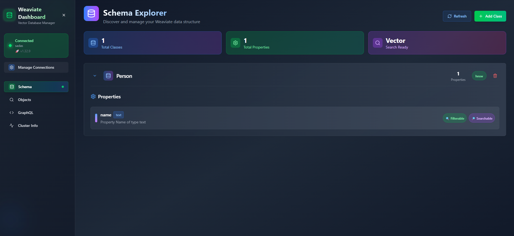

# Weaviate Dashboard

A modern, responsive web interface for managing and exploring Weaviate vector databases. Built with Next.js, TypeScript, and Tailwind CSS.




## ✨ Features

### 🔗 Connection Management
- **Add/Edit Connections**: Connect to Weaviate instances with URL and API key
- **Connection Testing**: Verify connectivity before saving
- **Connection Storage**: localStorage-based connection persistence
- **Connection Switching**: Easy switching between multiple instances

### 📊 Schema Management
- **Visual Schema Browser**: Browse classes and properties with detailed view
- **Add Classes**: Create new classes with custom properties and data types
- **Delete Classes**: Remove classes from your schema
- **Class Statistics**: View total classes and properties count
- **Property Details**: View property names, data types, and descriptions

### 🗃️ Object Management
- **Object Browser**: Browse objects with pagination (20 per page)
- **Add Objects**: Create new objects with dynamic forms based on class schema
- **Delete Objects**: Remove objects from your database
- **Object Details**: View complete object data with enhanced JSON visualization
- **Class Filtering**: Filter objects by specific classes

### 🔍 GraphQL Interface
- **Interactive Query Editor**: GraphQL playground with syntax highlighting (CodeMirror)
- **Example Queries**: Pre-built templates (Get Objects, Semantic Search, Where Filter, Aggregate, Explore)
- **Query Execution**: Run GraphQL queries against your Weaviate instance
- **Results Display**: Enhanced JSON visualization with copy/download functionality
- **Query Tips**: Built-in GraphQL syntax help and examples

### 🖥️ Cluster Information
- **Server Information**: View hostname and Weaviate version
- **Module Information**: Display enabled modules and their status
- **Raw Meta Data**: Complete server meta information with JSON viewer

### 🎨 Modern UI/UX
- **Dark Theme**: Eye-friendly dark interface with gradient backgrounds
- **Responsive Design**: Works on desktop, tablet, and mobile devices
- **Loading States**: Proper loading indicators for async operations
- **Error Handling**: User-friendly error messages and retry options
- **Component Library**: Built with shadcn/ui and Tailwind CSS

## 🚀 Quick Start

### Prerequisites

- **Node.js** 18.0 or higher
- **npm** or **yarn** package manager
- **Weaviate** instance running (local or remote)

### Installation

1. **Clone the repository**
   ```bash
   git clone https://github.com/evrenonur/weaviate-ui.git
   cd weaviate-ui
   ```

2. **Install dependencies**
   ```bash
   npm install
   # or
   yarn install
   ```

3. **Configure environment**
   ```bash
   cp .env.example .env
   ```
   
   Edit `.env` with your Weaviate configuration:
   ```env
   NEXT_PUBLIC_WEAVIATE_URL=http://localhost:8080
   NEXT_PUBLIC_WEAVIATE_API_KEY=your-api-key-here
   ```

4. **Start development server**
   ```bash
   npm run dev
   # or
   yarn dev
   ```

5. **Open your browser**
   Navigate to [http://localhost:3000](http://localhost:3000)

## 🐳 Docker Setup

### Using Docker Compose (Recommended)

```yaml
# docker-compose.yml
version: '3.8'
services:
  weaviate:
    command:
      - --host
      - 0.0.0.0
      - --port
      - '8080'
      - --scheme
      - http
    image: semitechnologies/weaviate:latest
    ports:
      - "8080:8080"
    environment:
      QUERY_DEFAULTS_LIMIT: 25
      AUTHENTICATION_ANONYMOUS_ACCESS_ENABLED: 'true'
      PERSISTENCE_DATA_PATH: '/var/lib/weaviate'
      DEFAULT_VECTORIZER_MODULE: 'none'
      ENABLE_MODULES: ''
      CLUSTER_HOSTNAME: 'node1'

  weaviate-dashboard:
    build: .
    ports:
      - "3000:3000"
    environment:
      - NEXT_PUBLIC_WEAVIATE_URL=http://weaviate:8080
    depends_on:
      - weaviate
```

### Manual Docker Build

1. **Build the Docker image**
   ```bash
   docker build -t weaviate-dashboard .
   ```

2. **Run the container**
   ```bash
   docker run -p 3000:3000 \
     -e NEXT_PUBLIC_WEAVIATE_URL=http://your-weaviate-host:8080 \
     weaviate-dashboard
   ```

## 📖 Usage Guide

### Managing Connections

1. **Click "Settings" icon** in the sidebar to open Connection Manager
2. **Add New Connection** with your Weaviate instance URL and optional API key
3. **Test Connection** to verify connectivity before saving
4. **Set as Active** to use the connection
5. **Switch between connections** as needed

### Creating Schema

1. **Navigate to Schema tab** (Database icon)
2. **Click "Add Class"** to create a new class
3. **Enter class name** and add properties with data types
4. **Save** to create the class in your Weaviate instance
5. **View class statistics** in the overview cards

### Adding Objects

1. **Go to Objects tab** (Search icon)
2. **Select a class** from the dropdown filter
3. **Click "Add Object"** to open the creation form
4. **Fill in property values** based on your class schema
5. **Create** to add the object to your database

### GraphQL Queries

1. **Open GraphQL tab** (Code icon)
2. **Choose from example queries** or write your own
3. **Use syntax highlighting** in the CodeMirror editor
4. **Click "Run Query"** to execute
5. **View results** in the enhanced JSON viewer with copy/download options

### Viewing Cluster Info

1. **Click Cluster Info tab** (Activity icon)
2. **View server information** (hostname, version)
3. **Check enabled modules** and their status
4. **Explore raw meta data** in the JSON viewer

## 🛠️ Development

### Project Structure

```
weaviate-dashboard/
├── src/
│   ├── components/          # React components
│   │   ├── ui/             # Reusable UI components
│   │   ├── schema/         # Schema management components
│   │   ├── objects/        # Object management components
│   │   └── graphql/        # GraphQL interface components
│   ├── lib/
│   │   ├── api/            # Weaviate API client
│   │   └── utils/          # Utility functions
│   ├── types/              # TypeScript type definitions
│   └── app/                # Next.js app router pages
├── public/                 # Static assets
└── docs/                   # Documentation
```

### Available Scripts

- `npm run dev` - Start development server
- `npm run build` - Build for production
- `npm run start` - Start production server
- `npm run lint` - Run ESLint
- `npm run type-check` - Run TypeScript compiler

### Environment Variables

| Variable | Description | Default |
|----------|-------------|---------|
| `NEXT_PUBLIC_WEAVIATE_URL` | Weaviate server URL | `http://localhost:8080` |
| `NEXT_PUBLIC_WEAVIATE_API_KEY` | Optional API key for authentication | - |
| `NEXT_PUBLIC_OIDC_CLIENT_ID` | OpenID Connect client ID | - |
| `NEXT_PUBLIC_OIDC_ISSUER` | OpenID Connect issuer URL | - |

## 🚀 Production Deployment

### Vercel (Recommended)

1. **Fork this repository**
2. **Import to Vercel**
3. **Set environment variables** in Vercel dashboard
4. **Deploy automatically** on every push

### Docker Production

1. **Build production image**
   ```bash
   docker build -t weaviate-dashboard:prod --target production .
   ```

2. **Run with production settings**
   ```bash
   docker run -p 3000:3000 \
     -e NODE_ENV=production \
     -e NEXT_PUBLIC_WEAVIATE_URL=https://your-weaviate-host \
     weaviate-dashboard:prod
   ```

## 🤝 Contributing

We welcome contributions! Please see our [Contributing Guide](CONTRIBUTING.md) for details.

### Development Workflow

1. **Fork** the repository
2. **Create** a feature branch (`git checkout -b feature/amazing-feature`)
3. **Commit** your changes (`git commit -m 'Add amazing feature'`)
4. **Push** to the branch (`git push origin feature/amazing-feature`)
5. **Open** a Pull Request

## 📋 Requirements

### Minimum Weaviate Version
- **Weaviate 1.20.0+** for full feature compatibility
- **REST API** and **GraphQL** endpoints enabled

### Browser Support
- **Chrome** 90+
- **Firefox** 90+
- **Safari** 14+
- **Edge** 90+

## 🐛 Troubleshooting

### Common Issues

**Connection Failed**
- Verify Weaviate is running and accessible
- Check URL format (include protocol: `http://` or `https://`)
- Ensure CORS is properly configured on Weaviate

**Objects Not Loading**
- Verify schema exists before adding objects
- Check class names match exactly (case-sensitive)
- Ensure proper data types for property values

**GraphQL Errors**
- Validate query syntax in the editor
- Check class and property names in your schema
- Verify GraphQL endpoint is enabled in Weaviate

## 📄 License

This project is licensed under the MIT License - see the [LICENSE](LICENSE) file for details.

## 🙏 Acknowledgments

- **[Weaviate](https://weaviate.io/)** - The amazing vector database
- **[Next.js](https://nextjs.org/)** - React framework for production
- **[Tailwind CSS](https://tailwindcss.com/)** - Utility-first CSS framework
- **[Lucide](https://lucide.dev/)** - Simple and beautiful icons

## 📞 Support

- **Documentation**: [Weaviate Documentation](https://weaviate.io/developers/weaviate)
- **Issues**: [GitHub Issues](https://github.com/evrenonur/weaviate-ui/issues)
- **Weaviate Community**: [Weaviate Slack](https://weaviate.io/slack)

---

**Made with ❤️ for the Weaviate community**
